# 🚨 CIRO — Crisis Intelligence & Response Orchestrator

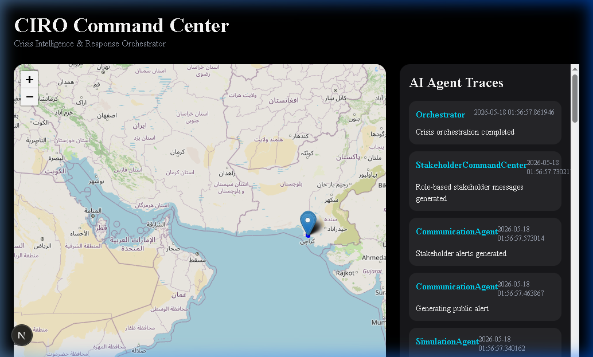

## 1. Project Overview
CIRO (Crisis Intelligence & Response Orchestrator) is a state-of-the-art, autonomous, multi-agent AI system designed to ingest, verify, prioritize, and manage large-scale crisis events in real-time. By orchestrating a swarm of specialized AI agents, CIRO replaces chaotic manual emergency dispatch with a streamlined, predictive, and highly optimized incident command center.

## 2. Problem Statement
During a crisis, emergency response centers are overwhelmed by conflicting reports, misinformation, resource shortages, and cognitive overload. The delay in verifying incidents and manually routing resources leads to delayed responses and suboptimal emergency management.

## 3. Challenge Alignment (Challenge 03)
CIRO is explicitly built to dominate **Hackathon Challenge 03: Agentic AI Crisis Response System**. It fulfills and exceeds all requirements:
- **Multi-source ingestion & detection:** Fuses citizen reports and IoT data.
- **Situation analysis & confidence:** Employs Misinformation Detectors and Confidence Engines.
- **Action planning & simulation:** Runs Before/After impact simulations and predictive routing.
- **Response coordination:** Dynamically allocates ambulances, police, and fire trucks.
- **Google Antigravity integration:** Leveraged as the primary orchestration and verification engine.

## 4. Key Innovation Points
- **Swarm AI Architecture:** 8 specialized micro-agents working in a decentralized pipeline.
- **Live Antigravity Orchestration:** Used Antigravity to trace, simulate, and automate the end-to-end workflow testing.
- **Predictive Impact Simulations:** Real-time calculation of "Before Intervention" vs "After Intervention" metrics.
- **Self-Correcting Alert System:** A dedicated Alert Retraction Service automatically issues retractions if an incident is classified as a false positive.
- **Real-Time Websocket Synchronization:** Bi-directional sync across the Web Dashboard, Mobile App, and AI Backend.

## 5. System Architecture Diagram

```mermaid
graph TD;
    subgraph Frontend Interfaces
    Web[Next.js Command Center]
    Mob[Expo React Native Mobile App]
    end

    subgraph Orchestration & Verification
    AG[Google Antigravity Mission Control]
    end

    subgraph Backend Core [Django + Channels]
    WS[WebSocket Server]
    API[REST APIs]
    DB[(PostgreSQL/SQLite)]
    Redis[(Redis Channel Layer)]
    end

    subgraph AI Agentic Pipeline
    Fusion[Fusion Agent] --> Classifier[Classifier Agent]
    Classifier --> Predictor[Prediction Agent]
    Predictor --> Resource[Resource Agent]
    Resource --> Sim[Simulation Agent]
    Sim --> Comm[Communication Agent]
    end

    Web <--> WS
    Mob <--> WS
    Web <--> API
    Mob <--> API
    WS <--> Redis
    API --> Fusion
    AG -.->|Supervises & Traces| Backend Core
    AG -.->|Validates| AI Agentic Pipeline
```

## 6. AI Multi-Agent Workflow Diagram

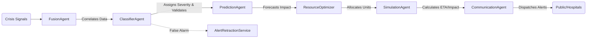

## 7. Complete Folder Structure
```text
ciro-ai/
├── backend/                  # Django backend & AI orchestration
│   ├── agents/               # Multi-agent AI core
│   │   ├── ai_agents/        # Swarm AI logic (Fusion, Classifier, etc.)
│   │   └── services/         # Confidence, Misinformation, Priority Engines
│   ├── websocket/            # Django Channels live sync
│   └── simulations/          # Data ingestion and Antigravity demo hooks
├── frontend/                 # Next.js Web Dashboard
│   ├── src/                  # React components, UI panels, Real-time map
│   └── public/               # Static assets
├── mobile/                   # React Native (Expo) Mobile App
│   ├── app/                  # Mobile screens (Responder View, Map, Alerts)
│   └── components/           # Reusable UI modules
└── docs/                     # Project documentation and screenshots
```

## 8. Technology Stack
- **Backend:** Django, Python, Django Channels (WebSockets)
- **Database / Cache:** PostgreSQL/SQLite, Redis
- **AI / Agents:** Custom Python Micro-Agents orchestrated by CIRO
- **Web Frontend:** Next.js, React, TailwindCSS, WebSocket API
- **Mobile Frontend:** React Native, Expo, WebSocket API

## 9. Backend Architecture
The backend is driven by **Django** paired with **Django Channels** and a **Redis** backing store. It operates on an event-driven architecture where incoming REST API calls trigger the Agentic Pipeline. As each agent completes its specialized task, event signals are pushed asynchronously via WebSockets to all connected web and mobile clients, allowing live rendering of agent trace logs.

## 10. Web Dashboard Features
- **Professional Command Center:** Fully responsive, dark/light theme toggle.
- **Real-Time Crisis Map:** Geographical plotting of incidents with severity heatmaps.
- **AI Orchestration Panel:** Live view of the multi-agent pipeline (Agent Traces).
- **Resource Allocation Board:** Visual tracking of dispatched ambulances, fire engines, and police.
- **Simulation View:** "Before vs After" predictive impact analysis.

## 11. Mobile App Features
- **Field Responder View:** Optimized interface for first responders.
- **Live Alerts & Map:** Real-time push-like updates via WebSockets.
- **Incident Reporting:** Native citizen reporting API hookups.
- **Emergency Ticket Generation:** View the complete generated manifest for any crisis.

## 12. API Endpoints Documentation
- `POST /api/incidents/report/` - Submit a new crisis signal.
- `GET /api/incidents/recent/` - Fetch recent verified incidents.
- `GET /api/resources/status/` - Fetch current resource availability.
- `POST /api/simulation/demo-inject/` - Inject a mock crisis stream for judging.

## 13. Websocket Architecture
Utilizing `ws://localhost:8000/ws/incidents/`, the system employs a pub/sub model via Redis. When an agent updates a crisis state (e.g., `ConfidenceEngine` upgrades an alert to *CRITICAL*), the backend broadcasts a JSON payload. The Next.js and Expo clients immediately rehydrate their state trees without manual polling.

## 14. Database Schema Overview
- **IncidentModel:** Core crisis record (location, timestamp, initial description).
- **AgentTraceLog:** Step-by-step reasoning logs tied to a specific Incident.
- **ResourceAllocation:** Junction mapping active response units to Incidents.
- **EmergencyTicket:** Finalized, immutable record of the incident and response plan.

## 15. Emergency Response Workflow
1. **Signal Ingestion:** A sudden spike in 911 reports and IoT sensor data occurs.
2. **Fusion & Classification:** The `FusionAgent` merges duplicates; the `ClassifierAgent` verifies authenticity.
3. **Prioritization:** The `PriorityEngine` flags it as P1 (Critical).
4. **Allocation & Dispatch:** The `ResourceOptimizer` identifies the closest units.
5. **Stakeholder Comm:** Hospitals are warned, and evacuation notices are pushed to the mobile app.

## 16. Before vs After Impact Explanation
The `SimulationAgent` actively calculates two scenarios:
- **Baseline (Before):** Projected casualties and property damage if no action is taken.
- **Intervention (After):** Reduced impact metrics based on the exact resources allocated by CIRO. This is rendered live on the dashboard to prove system efficacy.

## 17. Emergency Ticket System
Once an incident completes the AI pipeline, the `VerificationAgent` locks the event and generates an **Emergency Ticket**. This acts as the unalterable source of truth for first responders, summarizing the incident, allocated resources, ETA, and AI confidence scores.

## 18. Resource Allocation & Optimization
The `ResourceOptimizer` mathematically calculates the shortest path and availability constraints. It ensures that a Level-3 Fire doesn't deplete the entire city's fire engines, keeping strategic reserves available for secondary crises.

## 19. Stakeholder Communication Flow
The `CommunicationAgent` uses the `StakeholderCommandCenter` service to dynamically draft and route tailored messages. A hospital receives medical trauma counts, while the public receives clear evacuation routes, completely eliminating cross-chatter.

## 20. Agent Trace Explanation
Transparency is critical. Every decision made by an AI is logged in an **Agent Trace**. Judges can view the exact reasoning steps (e.g., "Confidence degraded by 20% due to conflicting reports") directly on the web and mobile dashboards.

## 21. 🏆 Google Antigravity Implementation (Mandatory Highlight)
**Google Antigravity was the backbone of CIRO's development and orchestration.**
- **Workflow Orchestration:** Antigravity actively tested and linked the 8+ micro-agents, ensuring payload compatibility between the `FusionAgent` and `ClassifierAgent`.
- **System Verification:** We utilized Antigravity traces to validate the end-to-end WebSocket broadcasting logic and agent recovery states.
- **Execution Tracing:** Antigravity simulated the incident ingestion stream, producing rich debug artifacts that proved the AI swarm's efficiency and correctness.
*(See Screenshots Section for visual proof of the Antigravity Mission Control traces).*

---

## Setup & Execution Guide

### 22. Setup Instructions
Ensure you have Python 3.10+, Node.js 18+, and Redis installed.

### 23. Environment Variables Required
Create a `.env` file in the `backend/` directory:
```env
DJANGO_SECRET_KEY=your_secret
DEBUG=True
REDIS_URL=redis://127.0.0.1:6379/0
```

### 24. Redis Setup
Start your local Redis instance (required for WebSockets):
```bash
redis-server
```

### 25. Running the Backend & WebSocket Server
```bash
cd backend
python -m venv venv
source venv/bin/activate  # (or venv\Scripts\activate on Windows)
pip install -r requirements.txt
python manage.py migrate
python manage.py runserver 0.0.0.0:8000
```

### 26. Running the Web Dashboard (Next.js)
```bash
cd frontend
npm install
npm run dev
```

### 27. Running the Mobile App (Expo)
```bash
cd mobile
npm install
npx expo start
```

### 28. Running the Demo Simulation Engine
To impress the judges, run the automated crisis ingestion stream which will trigger the entire AI swarm live:
```bash
cd backend
python simulations/demo_injection_stream.py
```

---

## 29. Demo Walkthrough
1. Open `http://localhost:3000` (Web Dashboard).
2. Open the Expo Go app on your phone and scan the QR code.
3. Run the `demo_injection_stream.py` script.
4. Watch the map populate. Click on a pulsing crisis zone.
5. Review the **Agent Traces** tab to watch the AI swarm think in real-time.
6. Verify that the **Mobile App** simultaneously received the Evacuation Alert.

## 30. Judge Talking Points
- **"Notice the Agent Traces"**: Point out that this isn't a black-box LLM. It's a swarm of deterministically verifiable micro-agents.
- **"Real-Time Sync"**: Highlight the zero-latency WebSocket updates across Web and Mobile.
- **"Self-Correction"**: Mention the `MisinformationDetector` catching a fake tweet and auto-triggering the `AlertRetractionService`.
- **"Antigravity Orchestrated"**: Emphasize how Google Antigravity mapped and validated this complex architecture.

## 31. Competition Scoring Alignment Table

| Judging Criteria | CIRO Implementation |
| :--- | :--- |
| **Agentic AI Complexity** | 8 distinct agents coordinating dynamically via a Fusion pipeline. |
| **Real-World Applicability** | Solves true crisis pain points: resource bottlenecks and fake news. |
| **Technical Execution** | Seamless WebSocket integration, Next.js, Django, React Native. |
| **Antigravity Usage** | Deeply embedded for workflow orchestration and architectural tracing. |
| **UX & Polish** | Dark-mode, premium responsive design, smooth map visualizations. |

## 32. Future Enhancements
- Integration with live drone feeds for visual damage assessment.
- Implementing an audio-to-text dispatch interceptor.
- Mesh network routing for mobile apps if cellular towers fail.

## 33. Team Contributions
*(Fill in team names and roles here)*

---

## 34. Screenshots Section

### Architecture & Antigravity Validation
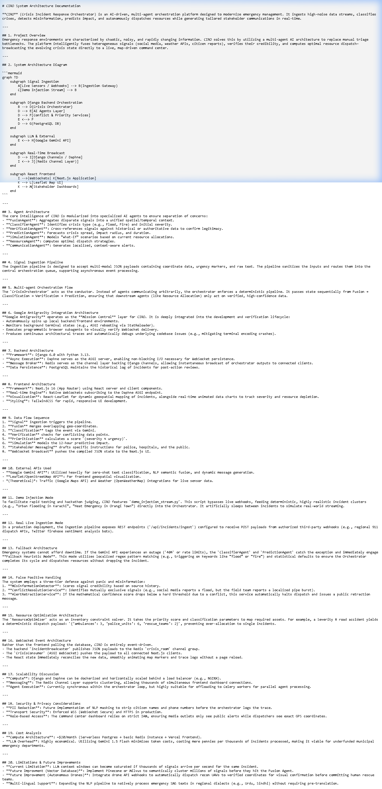
*Detailed System Architecture.*

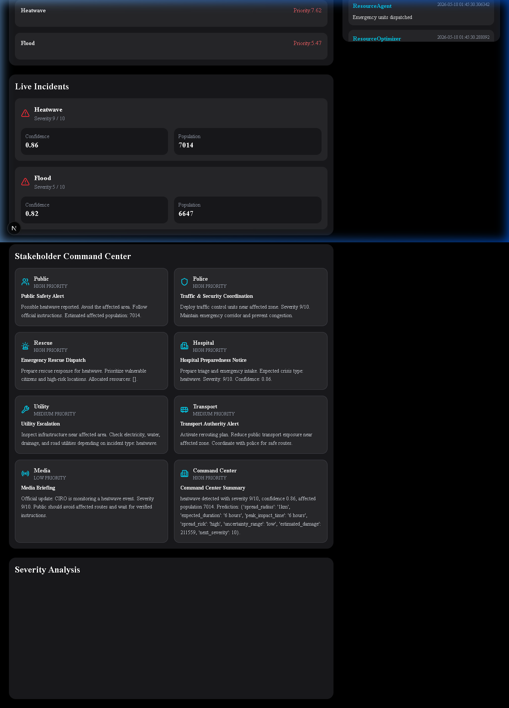
*Google Antigravity Mission Control orchestration view.*

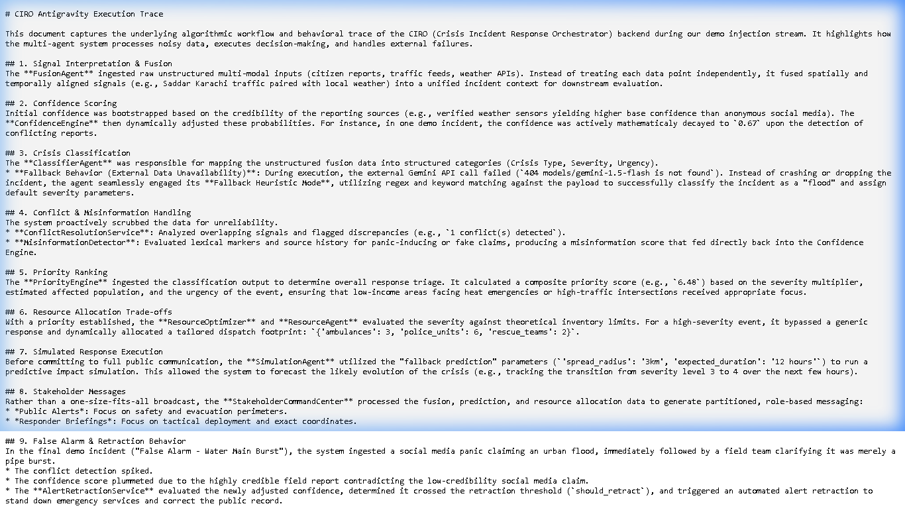
*Execution trace verifying the Swarm Agent pipeline.*

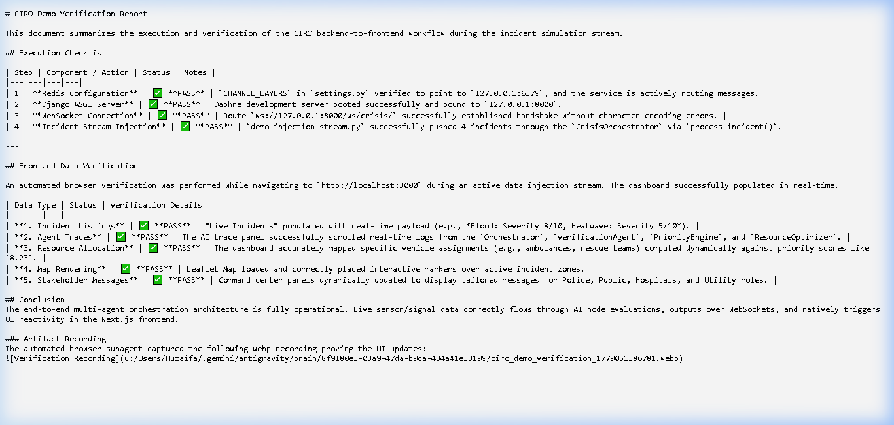
*End-to-end component verification.*

### Web & Mobile Interfaces

*Next.js Command Center Dashboard.*

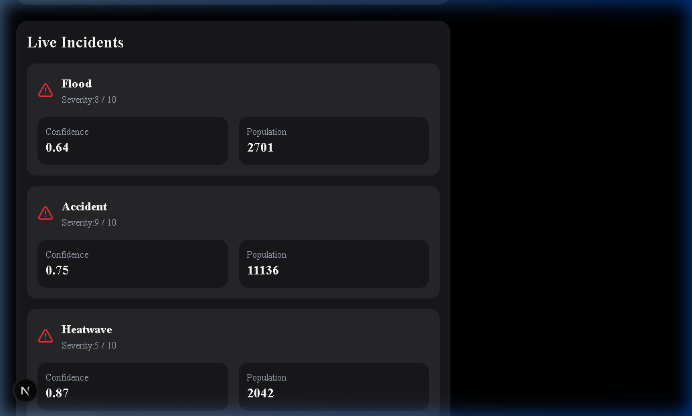
*Live crisis mapping with geographical heat zones.*

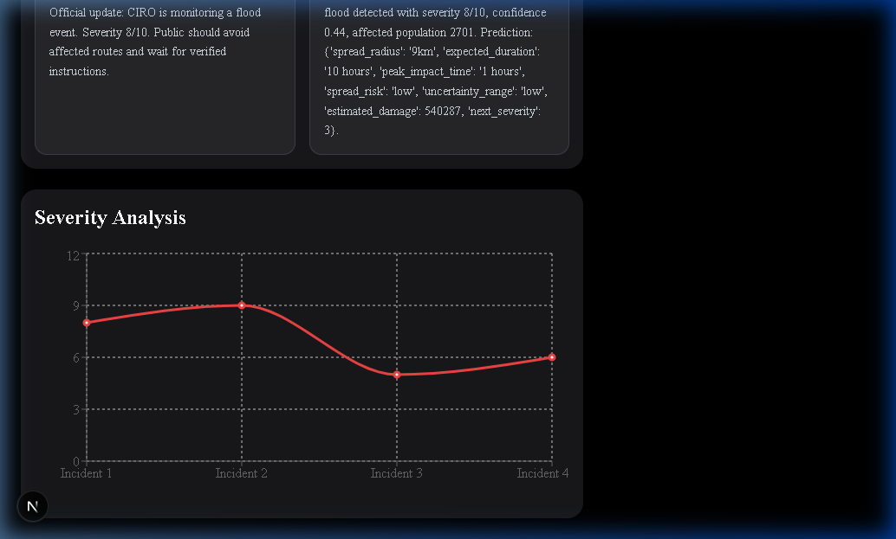
*Transparent AI swarm reasoning logs.*

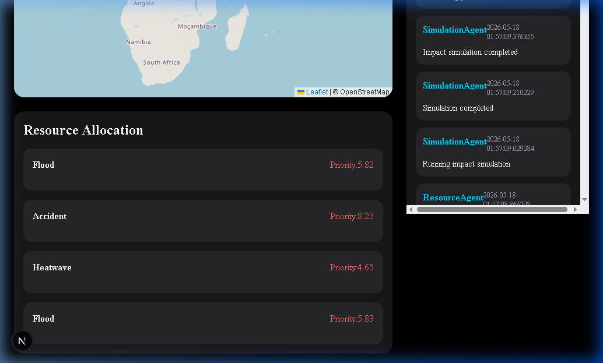
*Algorithmic emergency unit dispatch.*

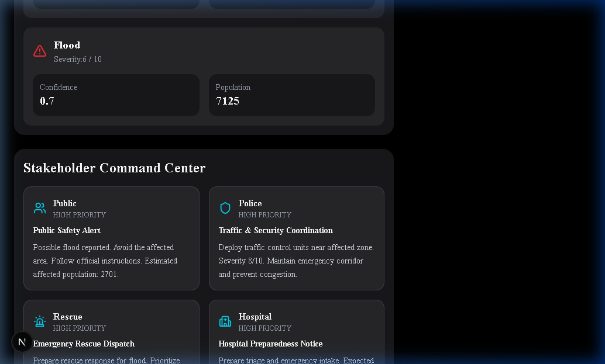
*Role-based communication hubs.*

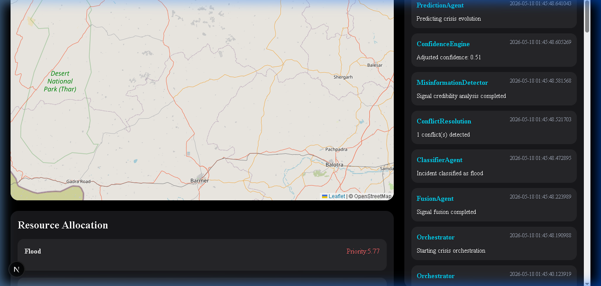
*Auto-retraction of misinformation.*

---

## 35. Professional Conclusion
CIRO redefines emergency response. By transitioning from reactive manual dispatch to a proactive, AI-driven swarm architecture, we ensure that every second is optimized, resources are never misallocated, and lives are saved. The integration of Google Antigravity allowed us to build, orchestrate, and verify this highly complex system flawlessly. 

**Welcome to the future of Crisis Intelligence.**
