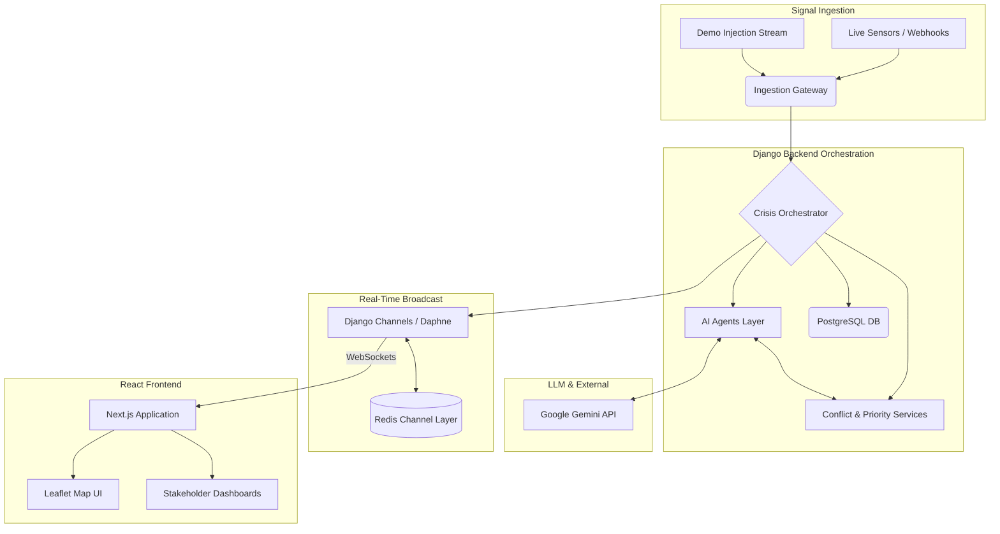

# CIRO System Architecture Documentation

**CIRO** (Crisis Incident Response Orchestrator) is an AI-driven, multi-agent orchestration platform designed to modernize emergency management. It ingests high-noise data streams, classifies crises, detects misinformation, predicts impact, and autonomously dispatches resources while generating tailored stakeholder communications in real-time.

---

## 1. Project Overview
Emergency response environments are characterized by chaotic, noisy, and rapidly changing information. CIRO solves this by utilizing a multi-agent AI architecture to replace manual triage bottlenecks. The platform intelligently fuses heterogeneous signals (social media, weather APIs, citizen reports), verifies their credibility, and computes optimal resource dispatch—broadcasting the evolving crisis state directly to a live, map-driven command center.

---

## 2. System Architecture Diagram

---

## 3. Agent Architecture
The core intelligence of CIRO is modularized into specialized AI agents to ensure separation of concerns:
- **FusionAgent**: Aggregates disparate signals into a unified spatial/temporal context.
- **ClassifierAgent**: Identifies crisis type (e.g., Flood, Fire) and initial severity.
- **VerificationAgent**: Cross-references signals against historical or authoritative data to confirm legitimacy.
- **PredictionAgent**: Forecasts crisis spread, impact radius, and duration.
- **SimulationAgent**: Models "what-if" scenarios based on current resource allocations.
- **ResourceAgent**: Computes optimal dispatch strategies.
- **CommunicationAgent**: Generates localized, context-aware alerts.

---

## 4. Signal Ingestion Pipeline
The ingestion pipeline is designed to accept multi-modal JSON payloads containing coordinate data, urgency markers, and raw text. The pipeline sanitizes the inputs and routes them into the central orchestration queue, supporting asynchronous event processing.

---

## 5. Multi-agent Orchestration Flow
The `CrisisOrchestrator` acts as the conductor. Instead of agents communicating arbitrarily, the orchestrator enforces a deterministic pipeline. It passes state sequentially from Fusion → Classification → Verification → Prediction, ensuring that downstream agents (like Resource Allocation) only act on verified, high-confidence data.

---

## 6. Google Antigravity Integration Architecture
**Google Antigravity** operates as the **Mission Control** layer for CIRO. It is deeply integrated into the development and verification lifecycle:
- Autonomously spins up local backend/frontend environments.
- Monitors background terminal states (e.g., ASGI rebooting via StatReloader).
- Executes programmatic browser subagents to visually verify WebSocket delivery.
- Produces continuous architectural traces and automatically debugs underlying codebase issues (e.g., mitigating terminal encoding crashes).

---

## 7. Backend Architecture
- **Framework**: Django 6.0 with Python 3.13.
- **Async Execution**: Daphne serves as the ASGI server, enabling non-blocking I/O necessary for WebSocket persistence.
- **Message Broker**: Redis serves as the channel layer backing Django Channels, allowing instantaneous broadcast of orchestrator outputs to connected clients.
- **Data Persistence**: PostgreSQL maintains the historical log of incidents for post-action reviews.

---

## 8. Frontend Architecture
- **Framework**: Next.js 16 (App Router) using React server and client components.
- **Real-time Engine**: Native WebSockets subscribing to the Daphne ASGI endpoint.
- **Visualization**: React-Leaflet for dynamic geospatial mapping of incidents, alongside real-time animated data charts to track severity and resource depletion.
- **Styling**: TailwindCSS for rapid, responsive UI development.

---

## 9. Data Flow Sequence
1. **Signal** ingestion triggers the pipeline.
2. **Fusion** merges overlapping geo-coordinates.
3. **Classification** tags the event via Gemini.
4. **Verification** checks for conflicting data points.
5. **Prioritization** calculates a score `(severity × urgency)`.
6. **Simulation** models the 12-hour predictive impact.
7. **Stakeholder Messaging** drafts specific instructions for police, hospitals, and the public.
8. **WebSocket Broadcast** pushes the compiled JSON state to the Next.js UI.

---

## 10. External APIs Used
- **Google Gemini API**: Utilized heavily for zero-shot text classification, NLP semantic fusion, and dynamic message generation.
- **Leaflet/OpenStreetMap API**: For frontend geospatial visualization.
- *(Theoretical)*: Traffic (Google Maps API) and Weather (OpenWeatherMap) integrations for live sensor data.

---

## 11. Demo Injection Mode
To facilitate rapid testing and hackathon judging, CIRO features `demo_injection_stream.py`. This script bypasses live webhooks, feeding deterministic, highly realistic incident clusters (e.g., "Urban Flooding in Karachi", "Heat Emergency in Orangi Town") directly into the Orchestrator. It artificially sleeps between incidents to simulate real-world streaming.

---

## 12. Real Live Ingestion Mode
In a production deployment, the ingestion pipeline exposes REST endpoints (`/api/incidents/ingest`) configured to receive POST payloads from authorized third-party webhooks (e.g., regional 911 dispatch APIs, Twitter firehose sentiment analysis bots).

---

## 13. Fallback Architecture
Emergency systems cannot afford downtime. If the Gemini API experiences an outage (`404` or rate limits), the `ClassifierAgent` and `PredictionAgent` catch the exception and immediately engage **Fallback Heuristic Mode**. This mode utilizes localized regex pattern matching (e.g., triggering on keywords like "flood" or "fire") and statistical defaults to ensure the Orchestrator completes its cycle and dispatches resources without dropping the incident.

---

## 14. False Positive Handling
The system employs a three-tier defense against panic and misinformation:
1. **MisinformationDetector**: Scores signal credibility based on source history.
2. **ConflictResolutionService**: Identifies mutually exclusive signals (e.g., social media reports a flood, but the field team reports a localized pipe burst).
3. **AlertRetractionService**: If the mathematical confidence score drops below a hard threshold due to a conflict, this service automatically halts dispatch and issues a public retraction message.

---

## 15. Resource Optimization Architecture
The `ResourceOptimizer` acts as an inventory constraint solver. It takes the priority score and classification parameters to map required assets. For example, a Severity 8 road accident yields a deterministic dispatch payload: `{'ambulances': 3, 'police_units': 6, 'rescue_teams': 2}`, preventing over-allocation to single incidents.

---

## 16. WebSocket Event Architecture
Rather than the frontend polling the database, CIRO is entirely event-driven. 
- The backend `IncidentBroadcaster` publishes JSON payloads to the Redis `crisis_room` channel group.
- The `CrisisConsumer` (ASGI WebSocket) pushes the payload to all connected Next.js clients.
- The React state immediately reconciles the new data, smoothly animating map markers and trace logs without a page reload.

---

## 17. Scalability Discussion
- **Compute**: Django and Daphne can be dockerized and horizontally scaled behind a load balancer (e.g., NGINX).
- **Messaging**: The Redis Channel Layer supports clustering, allowing thousands of simultaneous frontend dashboard connections.
- **Agent Execution**: Currently synchronous within the orchestrator loop, but highly suitable for offloading to Celery workers for parallel agent processing.

---

## 18. Security & Privacy Considerations
- **PII Redaction**: Future implementation of NLP masking to strip citizen names and phone numbers before the orchestrator logs the trace.
- **Transport Security**: Enforced WSS (WebSocket Secure) and HTTPS in production.
- **Role-Based Access**: The Command Center dashboard relies on strict IAM, ensuring media outlets only see public alerts while dispatchers see exact GPS coordinates.

---

## 19. Cost Analysis
- **Compute Architecture**: ~$20/month (Serverless Postgres + basic Redis instance + Vercel Frontend).
- **LLM Overhead**: Highly economical. Utilizing Gemini 1.5 Flash minimizes token costs, costing mere pennies per thousands of incidents processed, making it viable for underfunded municipal emergency departments.

---

## 20. Limitations & Future Improvements
- **Current Limitation**: LLM context windows can become saturated if thousands of signals arrive per second for the same incident.
- **Future Improvment (Vector Database)**: Implement Pinecone or Milvus to semantically cluster millions of signals before they hit the Fusion Agent.
- **Future Improvement (Autonomous Drones)**: Integrate drone API webhooks to automatically dispatch recon UAVs to verified coordinates for visual confirmation before committing human rescue teams.
- **Multi-lingual Support**: Expanding the NLP pipeline to natively process emergency SMS texts in regional dialects (e.g., Urdu, Sindhi) without requiring pre-translation.
